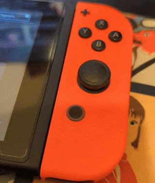

# Scriptease
A usable (yet inchoate) TAS/Automation toolkit for the Nintendo Switch with homebrew, compatible with latest firmware. The sys-module is based on sys-botbase, but it extends sys-botbase's functionality for TAS purposes.

For the list of commands, please refer to https://github.com/bedrockreal/Scriptease-sysmodule/blob/master/source/lua_wrap.cpp#L100

## Features:
### Remote Control:
- Set controller state
- Simulate buttons press, hold, and release
<!-- - Simulate touch screen drawing -->

### Memory Manipulation
- Read/write bytes of data from/to the Switch's RAM
- Freeze bytes of data on the Switch's RAM to any specific value

### Screen Control:
- Capture current screen and return as JPG
- Turn the screen on/off

### Tool-Assisted Superplay Support
- Pause/Unpause any game
- Frame advance functionalty
- Load nx-tas-formatted scripts

### Lua Scripting
- A fully-functional, interactive Lua console based on [sol3](https://github.com/ThePhD/sol2)

## Disclaimer:
This project was created for the purpose of development for bot automation. The creators and maintainers of this project are not liable for any damages caused or bans received. Use at your own risk.

## Installation
Clone this repository onto your computer and run `make sd` to build it. Copy the `sd/atmosphere` folder to your Nintendo Switch SD card's root directory. Restart your switch.

When installed correctly, sys-botbase will make your docked joy-con's home button glow on switch bootup. If this does not happen, sys-botbase is not installed correctly.

## Credits
- [olliz0r](https://github.com/olliz0r/sys-botbase) et al., authors of sys-botbase
- [hamhub7](https://github.com/hamhub7/tas-script) et al., authors of tas-script
